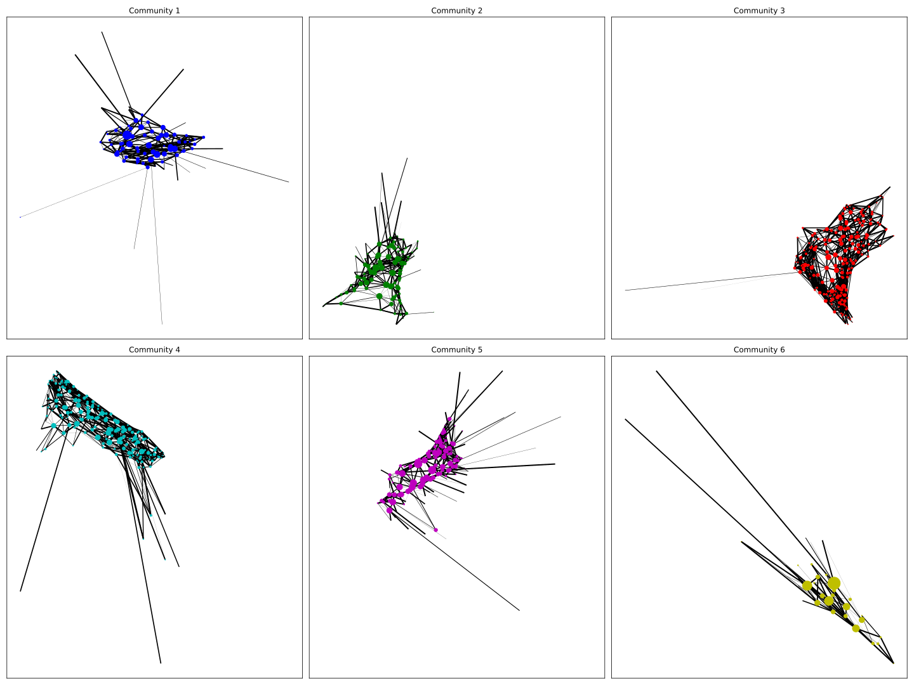
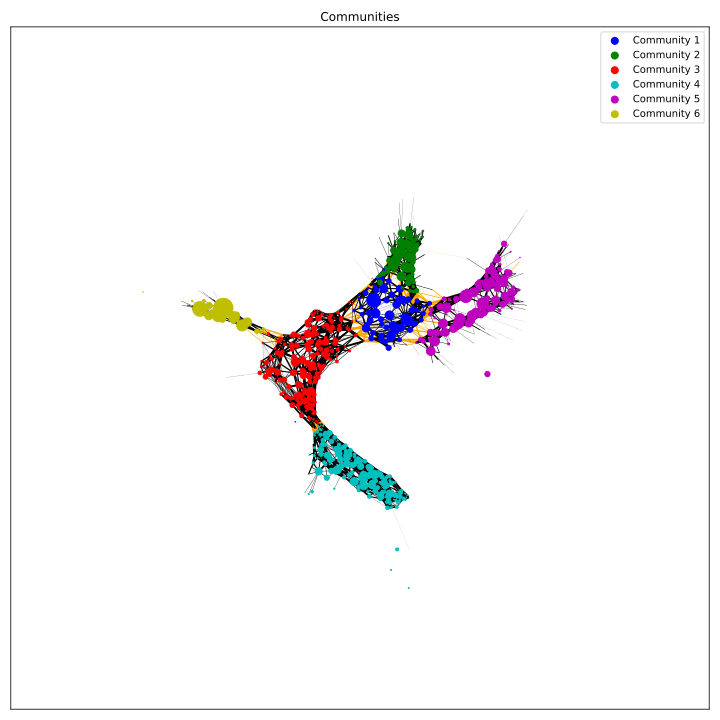
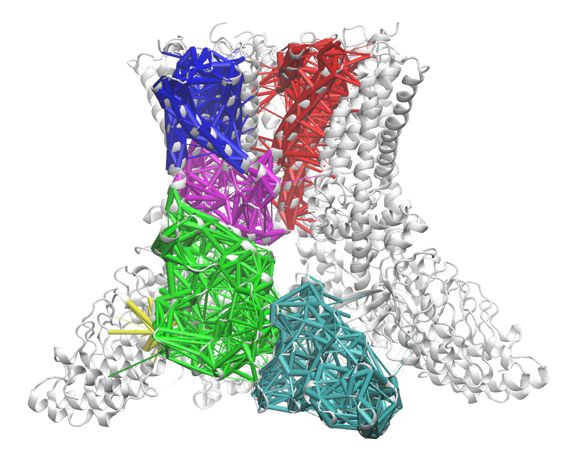
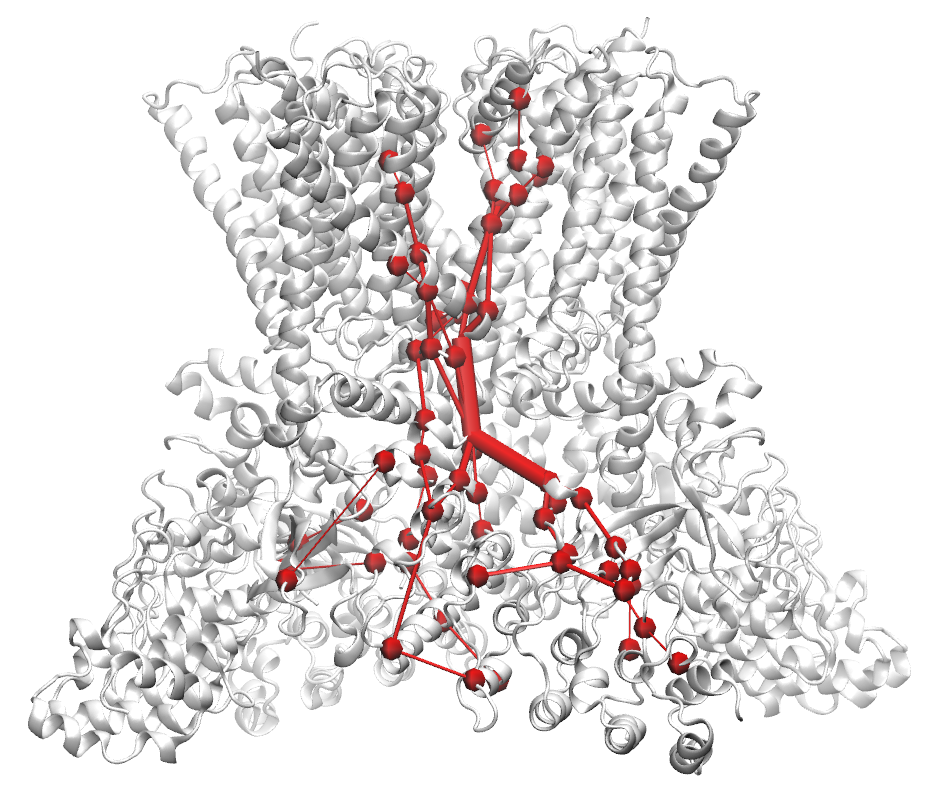

# Dynamic contact network

## Introduction
This repository is a tutorial to calculate **contact frequency data** from a MD simulation trajectory of a protein system and then use the frequency data to build a **dynamic contact network**. 

Contact frequency calculation is a routine calculation when tring to gain some basic meaningful interactions from statistics of frames in a trajectory, whereas dynamic contact network can help us use the network theory to understand how contacts are connected or grouped as a network based on the dynamics sampled in a trajectory. 

The dynamic contact network will only use contact frequencies as edges and C-alpha atoms of residues as nodes to build a network, and then construct a network for further betweenness centrality (importance of a node or edge, "how many times the shortest paths go through a specific node or edge"). Of note, this concept is different from the "traditional" [dynamic network analysis](https://luthey-schulten.chemistry.illinois.edu/tutorials/network/network_tutorial.pdf) using covariance matrix calculated based on the dynamic movement of residues in a simulation system.

## Tools and dependencies
1. [getcontacts](https://getcontacts.github.io/)
2. any dependencies required by getcontacts: numpy scipy expat matplotlib scikit-learn pytest pandas seaborn cython vmd-python

```python
conda install numpy scipy expat matplotlib scikit-learn pytest pandas seaborn cython

conda install -c conda-forge vmd-python

# networkx package: https://networkx.org/
pip install networkx
# networkx is supposed to require python > 3.8 version; but python 3.6 works fine
```
3. python==3.6 (only 3.6 was tested, other versions might also work just fine). 

4. VMD
5. mpld3: `pip install mpld3`
6. mplcursors: `pip install mplcursors`

## Contact frequency calculation
Contact frequencies could be easily calculated from getcontacts. Once you configure getcontacts properly in your own environment, `get_dynamic_contacts.py` is ready for such calculation.
```python
# Below are examples

# compute all interactions within protein chain A
get_dynamic_contacts.py --topology top.psf \
						--trajectory traj.dcd \
						--itypes all \
						--sele "protein and chain A" \
						--sele2 "protein and chain A" \
						--output chainA.tsv
# --itypes: interaction types. see: https://github.com/getcontacts/getcontacts

# compute all interactions between ligand and chain A
get_dynamic_contacts.py --topology top.psf \
						--trajectory traj.dcd \
						--itypes all \
						--sele "ligand" \
						--sele2 "protein and chain A" \
						--output chainA.tsv
# of note, --sele and --sele2 should use vmd selection syntax!
```
The resulting `chainA.tsv` will list all **atomic level** interactions defined in `getcontacts` by frames. Thus, it is not "frequency" yet. Below is an example result from my calculation: (in my system, I have 200 frames and the system consists of A~H eight chains. I calculated all interactions  of the protein)

```python
get_dynamic_contacts.py --topology protein.pdb --trajectory trj1.dcd --itypes all --sele "chain A B C D E F G H" --sele2 "chain A B C D E F G H" --output all.tsv
```

open `all.tsv` with vi or less:

```shell
# total_frames:200 beg:0 end:199 stride:1 interaction_types:hp,sb,pc,ps,ts,vdw,hb
# Columns: frame, interaction_type, atom_1, atom_2[, atom_3[, atom_4]]
0       sb      F:ASP:525:OD1   F:LYS:528:NZ
0       sb      G:ARG:628:NH1   G:ASP:622:OD2
0       sb      B:GLU:288:OE2   F:ARG:599:NH1
0       sb      H:ASP:525:OD1   H:LYS:528:NZ
0       sb      C:GLU:40:OE1    C:LYS:45:NZ
0       sb      B:ARG:257:NH2   B:GLU:216:OE2
0       sb      D:ARG:101:NH1   D:GLU:100:OE1
0       sb      C:ASP:314:OD2   C:LYS:318:NZ
...
199     hbss    C:LYS:318:NZ    G:SER:611:OG
199     hbbb    B:SER:416:O     B:TYR:420:N
199     hbsb    D:SER:487:O     H:ARG:514:NH2
199     hbbb    B:ILE:459:N     B:TYR:455:O
199     hbss    B:ARG:257:NH1   B:ASP:273:OD2
199     hbbb    C:LEU:271:O     C:PHE:259:N
199     hbsb    B:ILE:457:N     B:SER:456:OG
199     hbbb    H:GLN:589:N     H:ILE:585:O
```

As you can see, atomic interactions are specifically listed.

 We need to use `get_contact_frequencies.py` to further get frequencies. 

```python
get_contact_frequencies.py --input_files all.tsv --output_file all_frq.tsv
```

Of note, atomic level interactions will **be compressed to residue-level interactions** during frequency calculation. Open `all_frq.tsv`:

```shell
#       total_frames:200        interaction_types:sb,pc,ps,ts,vdw,hb,lhb,hbbb,hbsb,hbss,wb,wb2,hbls,hblb,lwb,lwb2,br
#       Columns:        residue_1,      residue_2       frame_count     contact_frequency
D:ALA:231       D:MET:302       0.435
D:ILE:10        D:SER:15        0.980
A:LEU:26        A:THR:73        0.355
C:GLY:138       C:LEU:140       0.995
E:ILE:585       E:LEU:588       0.935
B:PHE:433       E:LEU:551       0.810
D:LEU:371       D:VAL:368       0.770
B:GLU:190       B:THR:192       0.995
C:GLN:150       C:ILE:99        0.990
D:GLN:403       D:SER:401       0.995
...
D:ILE:398       D:LYS:450       0.010
D:ILE:408       D:LEU:471       0.005
E:SER:541       E:VAL:547       0.005
A:LEU:437       A:VAL:436       0.005
E:ARG:606       E:LEU:605       0.005
D:PHE:433       F:ILE:550       0.005
D:ASN:394       D:TYR:406       0.005
D:ARG:189       D:GLN:240       0.005
B:ARG:208       B:LEU:255       0.005
B:ALA:94        B:PHE:84        0.005
C:PHE:433       C:VAL:432       0.005
B:ILE:462       B:LYS:461       0.005
```

## Network analysis: Community calculation and plot
Based on the network theory and the calculated contact frequencies, we want to represent each amino acid as a node and each contact as an edge connecting two residue nodes. Of note, the edges are weight by the contact frequecies. With this network representation of all contacts, we can analyze **communities** which shows groups of residues are connected through pre-defined interactions. Besides, we can also use **centrality** (from network theory) to analyze the important nodes (residues) and edges (contacts) and thus reveal key residues and contacts between and within communities.
For dividing the graph into separate communities, here I will use the most popular algorithm -- the `Girvan-Newman` algorithm. The algorithm separates a graph into different communities by progressively removing the edges with the highest betweenness centrality from the original graph and iteratively calculating betweenness of the rest.
```python
# python communities.py [frq.tsv] [number_of_communities] [output]
python communities.py all_frq.tsv 6 6comm

# this will generate:
1. 6comm.pkl --> a binary python pickle file contains 6 communities data
2. 6comm_pos.pkl	--> a pickle file contains pre-computed positions in the graph

# This two files will be further used to plot communities
# since people may want to divide the graph into different numbers of communities, this calculation is decoupled from the following plotting script
```
Now we have communities data and pre-computed positions for all nodes. We can plot the communities separately and together using the following command:
```python
python communities_plt.py all_frq.tsv 6comm

# this will generate
0. 6comm-community-[1-6].txt --> nodes and edge weights of each community; the third column is frequencies
1. 6comm_degree-community[1-6].csv --> degree centrality of the nodes of each community; the third column is degrees
2. 6comm_betweenness-community[1-6].csv --> betweenness centrality of the nodes of each community; the third column is betweennesses
3. 6comm_edge_betweenness.txt --> betweenness centrality of the edges of the whole graph; the third column is betweenesses of edges
4. 6comm_crossing_nodes.dat --> nodes and edges that are in between communities; the third column is frequencies
5. 6comm_sep.svg --> each community is plotted separately; lines connecting two nodes are weighted by edge weights
6. 6comm_toget.svg --> all communities are plotted together with thickness of edges weighted by edge weights from the graph

# Some of those files are necessary for the next section -- VMD visualization
```
The two images from the above example:



## Visualization in VMD

We have done a lot of community calculations so far. And now if we want to visualize those communities on VMD based on a preloaded PDB, which would be the same PDB file you used in the first section. In this case, those `6comm--community-[1-6].txt` will be very helpful. For example, 6comm-community-1.txt has three columns with the first two being the nodes and the last being the edge weights (which are inherited from the original frequency data).

For visualization of communities, `draw_interactions.tcl` need to be loaded into the vmd command line window. Then, we need to read data from those community txt files and draw connections between nodes.

```python
# the following lines need to be executed in vmd command line window
source draw_interactions.tcl

set data1 [read_data "6comm-community-1.txt"]
draw_interactions $data1 blue

set data2 [read_data "6comm-community-2.txt"]
draw_interactions $data2 green

set data3 [read_data "6comm-community-3.txt"]
draw_interactions $data3 red

set data4 [read_data "6comm-community-4.txt"]
draw_interactions $data4 cyan

set data5 [read_data "6comm-community-5.txt"]
draw_interactions $data5 magenta

set data6 [read_data "6comm-community-6.txt"]
draw_interactions $data6 yellow

```

The final vmd window would be like: (Here my protein is a TRP ion channel):



In another case, when we want to visualize the edges with the highest betweenness centrality, we need to use `6comm_edge_betweenness.txt`. In this txt file, the third column is the betweenness values of edges, instead of contact frequencies. However, drawing all betweenness will make the whole graph window full of lines and connections, which is kind of messy. Here, let's say, we only care about the top 50 betweenness edges (the most important edges).

```shell
# in bash shell
head -n 50 6comm_edge_betweenness.txt > 6comm_edge_betweenness_top50.txt

# in vmd command line window
source draw_interactions.tcl
set edge [read_data "6comm_edge_betweenness_top50.txt"]
draw_interactions $edge red 10 1

# here the "10" is a scale factor: betweenness * 10 as the radius of cylinder connecting two C-alpha atoms of two residue nodes
# "1", means to draw C-alpha atoms as red VDW spheres in the vmd graphic window
```

The vmd graphic window would be like:


Using the same idea, we can also make use of `6comm_crossing_nodes.dat`: (of note, the third column is the frequency data)

```shell
# in vmd command line window
source draw_interactions.tcl
set crossing [read_data "6comm_crossing_nodes.dat"]
draw_interactions $crossing red 1 1
```